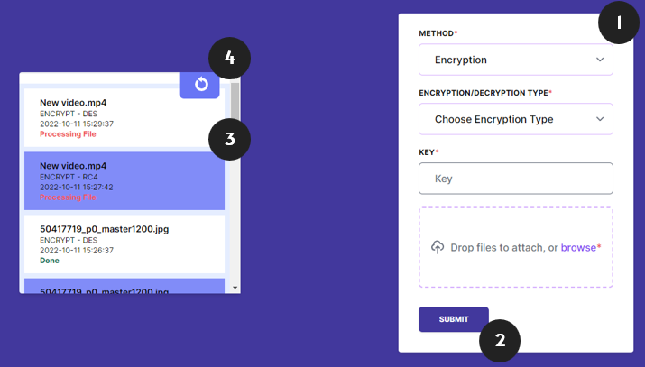
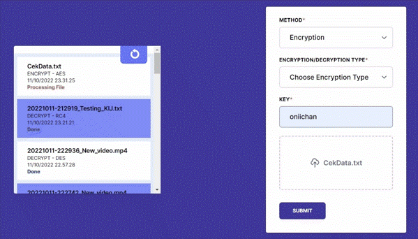

# Project Fullstack Flask using REST API + SocketIO for Encryption AES, DES, and RC4

Created with :gift_heart: by Keluarga Kosimp

## Introduction
Implementation of encryption to help transfer text and binary files between client and server. This project uses Output Feedback (OFB) mode for block cipher and encryption algorithms, such as [AES](https://en.wikipedia.org/wiki/Advanced_Encryption_Standard), [RC4](https://en.wikipedia.org/wiki/RC4), and [DES](https://en.wikipedia.org/wiki/Data_Encryption_Standard). The server works to encrypt and decrypt uploaded file when it sends using form-data. The client side also contains socket to determine if there is new file sent by other users need to be checked realtime.

## Project Overview
The image below is the interface of the fullstack app. When starting the project, it just needs four steps to use this app. The features available are:
1. Fill the form. It also has the validation.
2. Submit your form, and it will trigger socket to all user for the update.
3. Check file if the encryption is still in progress or done. You could also track all the progress.
4. Refresh list if it takes long for file to be done.



For the animation, you could check this animation.


This project contains the usage of frameworks (except for the algorithm):
- [Flask](https://flask.palletsprojects.com/en/2.2.x/) (using MongoDB as database)
- [SocketIO](https://flask-socketio.readthedocs.io/en/latest/)
- [Tailwind](https://tailwindui.com/)

## Collaborators
- [05111940000018 - Pramudya Tiandana Wisnu Gautama](https://github.com/wisnupramoedya)
- [05111940000062 - Thomas Felix Brilliant](https://github.com/ThomasFel)
- [05111940000096 - Stefanus Albert Kosim](https://github.com/yanzkosim)
- [05111940000175 - Muhammad Daffa](https://github.com/daffainfo)

## Requirements
Things need to have before starting this project.
- [MongoDB](https://www.mongodb.com/try/download/community)
- [NPM](https://nodejs.org/en/download/)
- [Python3](https://www.python.org/downloads/) or just use in the `Scripts` folder

## How to Use The Project
### How to Prepare

1. Activate virtual env.
```
./Scripts/activate
```

2. Install the requirements needed.
```
pip install -r requirements.txt
```

3. If you want to create/update *requirements.txt*, add freeze.
```
pip3 freeze > requirements.txt
```

### How to Install Tailwind
1. Run npm install.
```
npm install
```

2. Install this PostCSS globally.
```
npm install --global postcss postcss-cli
```

Note:
- For some reason, there is a problem in loading automatics PostCSS in Tailwind. But, for every change, use this.
```
npx tailwindcss -i ./api/statics/src/main.css -o ./api/statics/dist/main.css --minify
```

### How to Run
1. Start the program.
```
./Scripts/python main.py
```

2. Access the localhost or ngrok (if you tunnel it).

## API Documentation
The API is documented in Postman [here](https://documenter.getpostman.com/view/12334932/2s83zgtjKv).

## Author's Note
This project is a part of Information and Network Security (C) 2022 course, Department of Informatics, ITS.